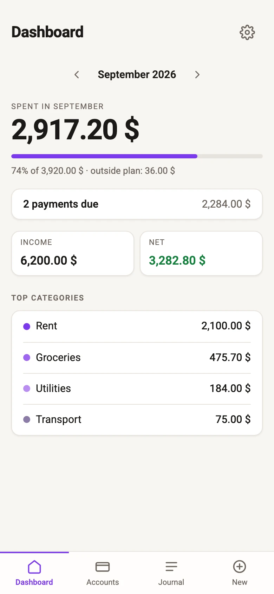

# Khesh

Offline-first household ledger using double-entry bookkeeping. Frontend-only (Vite + React); the working copy lives in IndexedDB on this device.

**[Try it: www.khesh.app](https://www.khesh.app)** - no signup, nothing to install.

<picture>
  <source media="(prefers-color-scheme: dark)" srcset="public/shots/dashboard-dark.webp">
  
</picture>

Double-entry, because every transfer between two of your own accounts should net to zero - no guessing whether "moved $200 to savings" was income, an expense, or nothing at all. No server, because the book doesn't need one: it lives in this device's IndexedDB, and stays there unless you turn on the optional Google Drive sync yourself.

## Privacy

No accounts, no server, no telemetry. Data never leaves the browser unless you export it yourself from Settings, or you connect the optional sync to your own Google Drive - then the book is stored, unencrypted, in a `khesh-book.json` file in that Google account's Drive and nowhere else. There is still no server of ours and no telemetry. The full policy is at [privacy.html](public/privacy.html), served at `/privacy.html`. A plain-language description of the app - what it does, and what the Drive scope is for - is at [about.html](public/about.html), served at `/about.html`; that URL is the one registered with Google as the app's home page.

## Disclaimer

This is an MVP, not accounting, tax, or investment advice. Books use `schemaVersion` 2; version 1 snapshots are migrated on load.

## Sync (optional)

Settings can connect the book to your own Google Drive (`drive.file` scope - the app
sees only the file it creates, or a file you explicitly pick to open). Building with
sync enabled needs a Google OAuth client id in `VITE_GOOGLE_CLIENT_ID` (env var or
`.env.local`); without it the Sync section is hidden and the app stays fully offline.

Family sharing - joining a book someone else already syncs - additionally needs the
Google Picker API enabled on the same Google Cloud project, and an API key in
`VITE_GOOGLE_PICKER_API_KEY`. Without it, "Connect" still works; only "Join a shared
book" stays hidden.

## Quick start

```bash
npm install
npm test
npm run dev
```

## Languages

English and Hebrew (RTL). Language is chosen once on the onboarding screen.

## Kernel

Ledger logic lives in `src/kernel` as pure commands and queries on a `Book`. It must not import React, IndexedDB, or DOM APIs. It is not published to npm.

## See also

- [CONTRIBUTING.md](CONTRIBUTING.md)
- [SECURITY.md](SECURITY.md)
- [ROADMAP.md](ROADMAP.md)
- [LICENSE](LICENSE)
